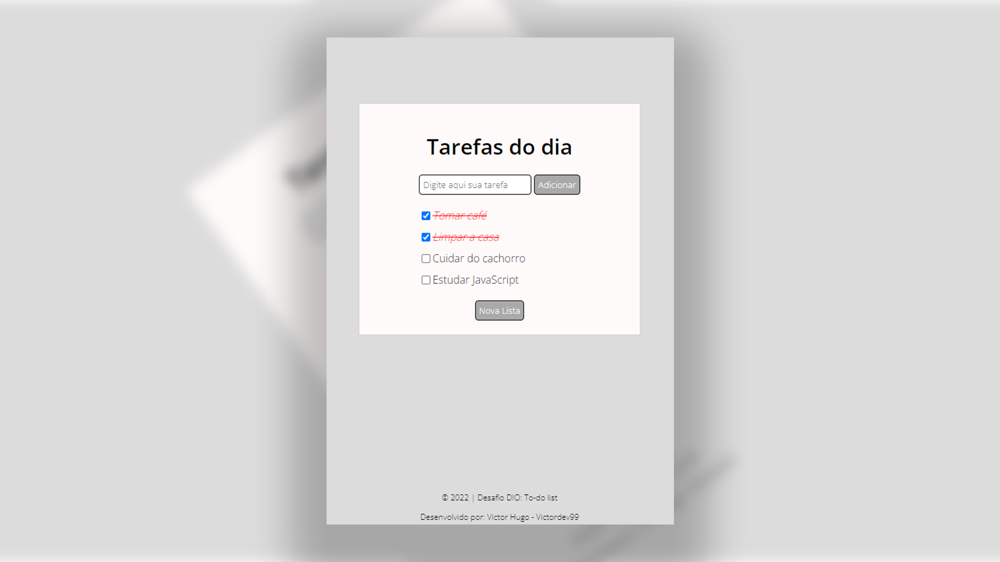

# 💻 | Projeto: To-do list - Desafio DIO.

### Projeto feito para por em prática as aulas: **Introdução ao JavaScript**.

Seja bem vindo ao meu projeto chamado To-do list, feito totalmente para meus estudos e aperfeiçoamento como profissional. ❤️

- Colocando em prática conceitos obtidos durante a aula.

- Utilizando: HTML, CSS e JavaScript.

### 📸 | Screenshots:

## 👩‍💻 Meus Links:

- Github: [Victor Hugo.](https://github.com/torugo99)
- LinkedIn: [Victor Hugo.](https://www.linkedin.com/in/victor-hugo99/)
- Meu Site: [Victor99dev.](http://victor99dev.site/)

### 😀 | Créditos e Agradecimentos:

- Obrigado a DIO a essa oportunidade de UP na minha carreira! ❤️